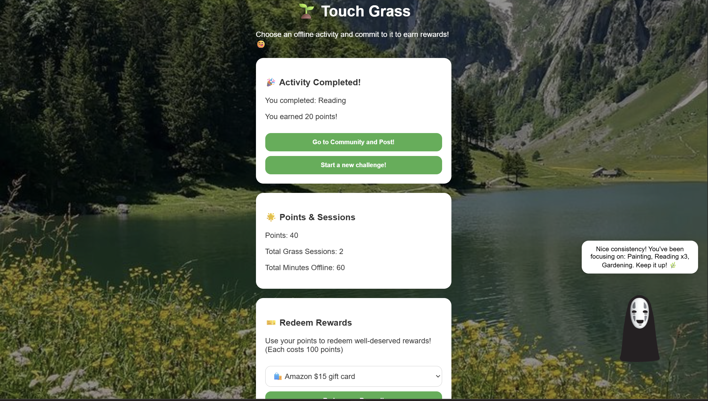
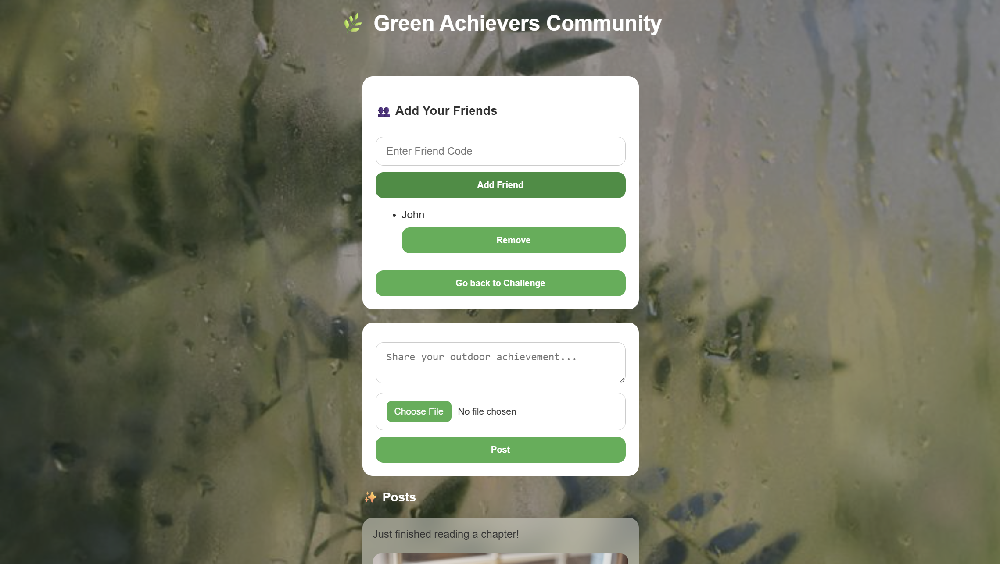

# 🌿 Green Achievers Community (Hackathon Project)

**Project Type:** Hackathon Demo (Team Project – mostly coded by one member)
**Duration:** 6 hours
**Technologies:** HTML, CSS, JavaScript, LocalStorage, Groq API

---

## Overview

The **Green Achievers Community** is a prototype web application designed to encourage users to complete offline activities, track progress, and share achievements with friends. The platform gamifies offline habits, awarding points and keeping a simple history of sessions.

This project was created in a **6-hour hackathon** under time constraints, so some features are **displayable but not fully functional**, serving as interactive placeholders for demonstration purposes.

---

## Project Structure

```plaintext
<hackathon-code>
│
├── home.html           
├── community.html
├── style.css
├── home.js
├── community.js
├── expr/ 
└── background/  
```

* **home.html** – Main activity page
* **community.html** – Community feed page
* **style.css** – Styling
* **home.js** – Main JS logic (home)
* **community.js** – Main JS logic (community)
* **expr/** – Mascot expression images
* **background/** – Background images
---

## Features

* **Activity Tracking:** Users can select predefined activities or enter custom activities, that is validated through an AI API.
* **Timer & Sessions:** Start a session timer and track points, sessions, and minutes spent.
* **Friend System:** Add and remove friends to share achievements.
* **Post Feed:** Share achievements with optional images.
* **Reward System:** Redeem points for rewards (demo).
* **Mascot Feedback:** Provides encouragement messages and AI-powered habit analysis.

> **Note:** The original code integrated AI API features to validate custom activities and provide habit feedback. For **security reasons**, API keys have been removed in the public repository. The AI responses are currently **mocked** for safe public demonstration.

---

## Usage

1. Clone or download the repository.
2. Open `home.html` in a web browser.
3. Navigate through activity selection, session timer, friend system, and feed demo.
4. Points, sessions, and activity history are stored locally via **LocalStorage**.

---

## Screenshots
* Home page
   
* Community page
   

---

## Future Improvements

Even though this project was a fast hackathon prototype, several realistic enhancements could be implemented in the future:

* **Integrate Database:** Replace localStorage with a backend database (e.g., Firebase, MongoDB, or PostgreSQL) to store users, posts, likes, comments, and friends. This allows persistent data and multi-device access.
* **Enhanced Social Feed:** Implement a user account system so each person can log in and interact. Real-time updates will allow live likes, comments, and friend activity notifications.
* **Integrate Computer Vision:** Integrate computer vision features to verify that user has really done their offline activity to validate sessions.
* **More Effective Reward System:** Include more dynamic reward types and more meaningful gamification mechanics, such as a ranking system.
* **Visual & UX Polish**: Better styling for inputs, buttons, post containers, and text readability over background images.


---

## Credits

This project was created as a **team hackathon entry**:

* **Coding & Implementation (80%)** – Sharon Dang I-Xuen
* **Conceptual contributions / AI-generated code snippets** – Manaswi Rambothu, Siddhiksha Reddy Gogireddy

> Professional transparency: The majority of implementation was done by one developer due to team skill distribution. Credit is given for idea contributions.
